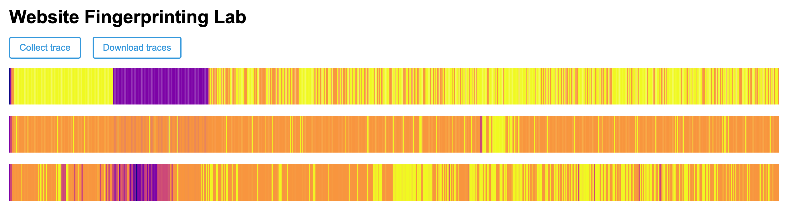

## Optional

**Report your browser version, CPU type, cache size, RAM amount, and OS. We use this information to learn about the attack’s behavior on different machines.**

- Browser:
- CPU:
- Cache sizes:
- RAM:
- OS:


## 1-2

**Use the values printed on the webpage to find the median access time and report your results as follows.**

| Number of Cache Lines | Median Access Latency (ms) |
| --------------------- | -------------------------- |
| 1                     |           0                 |
| 10                    |           0                 |
| 100                   |           0                 |
| 1,000                 |           0                 |
| 10,000                |   0.10000002384185791       |
| 100,000               |   0.20000004768371582       |
| 1,000,000             |   1.1999999284744263        |
| 10,000,000            |           N/A               |


## 1-3

**According to your measurement results, what is the resolution of your `performance.now()`? In order to measure differences in time with `performance.now()``, approximately how many cache accesses need to be performed?**

The resolution of performance.now() is about .1 ms since that is the first measurable value. We needed atleast 10,000 cache accesses to reach this threshold. In order to limit the effect of noise, it would probably be more helpful to use 100,000 cache accesses.


## 2-2

**Report important parameters used in your attack. For each sweep operation, you access N addresses, and you count the number of sweep operations within a time interval P ms. What values of N and P do you use? How do you choose N? Why do not you choose P to be larger or smaller?**

Over the 5 second recording period, we produce 1000 trace samples, and for each sweep, we traverse an 8mb buffer, and in the doOneSweep() function, we access the buffer every STRIDE elements, so the numhber of addresses touched per sweep is N = (buffer.length)/STRIDE = 131072.

We chose N by selecting a buffer that is large enough to create cache pressure and scanning it at a fixed stride so that each access targets a different cache line (stride = 64 bytes for a Uint8Array). This makes each sweep represent a consistent, repeatable memory access workload.

We chose P = 5 ms as a balance between time resolution and stability. If P were smaller, measurements would be more sensitive to timer resolution and scheduling noise, leading to a noisier trace. If P were larger, the trace would contain fewer samples over the same 5-second interval, reducing time resolution and making changes harder to observe in the trace.


## 2-3

**Take screenshots of the three traces generated by your attack code and include them in the lab report.**




## 2-4

**Use the Python code we provided in Part 2.1 to analyze simple statistics (mean, median, etc.) on the traces from google.com and nytimes.com. Report the statistic numbers.**

### Google.com Trace Statistics
- **Mean:** 24.95
- **Median:** 30.43
- **Standard Deviation:** 7.69
- **Minimum:** 14.26
- **Maximum:** 30.87

### NYTimes.com Trace Statistics
- **Mean:** 29.64
- **Median:** 29.68
- **Standard Deviation:** 0.10
- **Minimum:** 29.37
- **Maximum:** 29.75


## 2-6

**Include your classification results in your report.**

```
                           precision    recall  f1-score   support

   https://www.google.com       0.73      0.80      0.76        40
  https://www.nytimes.com       1.00      1.00      1.00        40
https://www.wikipedia.org       0.60      0.68      0.64        40
  https://www.youtube.com       0.84      0.65      0.73        40

                 accuracy                           0.78       160
                macro avg       0.79      0.78      0.78       160
             weighted avg       0.79      0.78      0.78       160

```


## 3-2

**Include your new accuracy results for the modified attack code in your report.**

```

```


## 3-3

**Compare your accuracy numbers between Part 2 and 3. Does the accuracy decrease in Part 3? Do you think that our “cache-occupancy” attack actually exploits a cache side channel? If not, take a guess as to possible root causes of the modified attack.**

